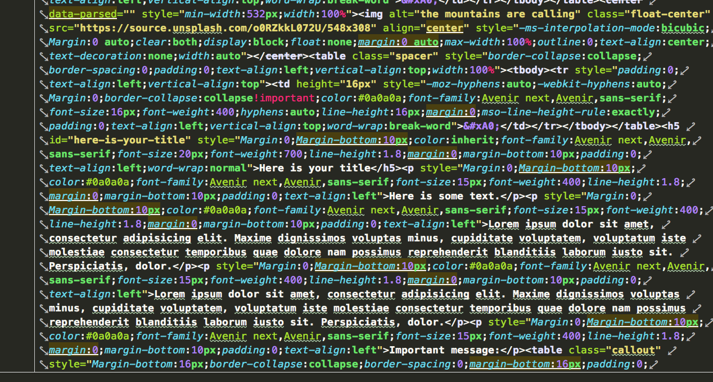
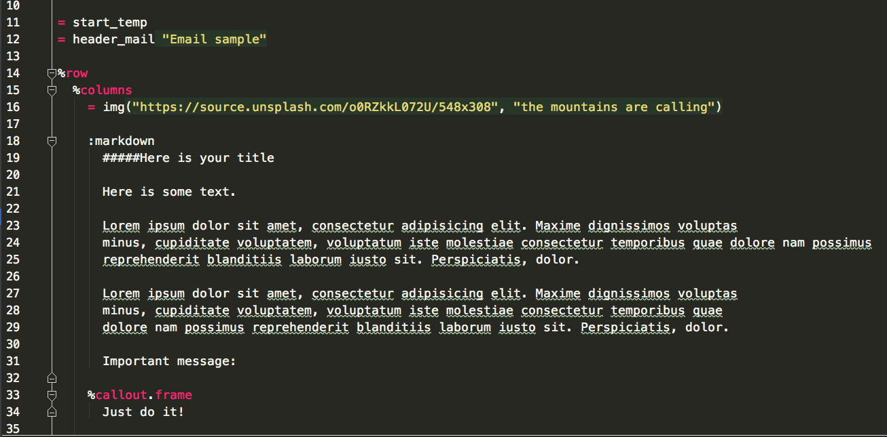
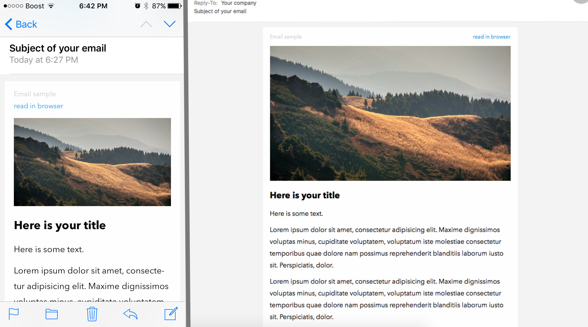

Easy HTML emails
----------------

This project uses [Foundation for Emails framework](http://foundation.zurb.com/emails).
And it allows you to create templates using HAML and Markdown and get as a result:
- "mail" version page (HTML version ready to be emailed)
- "web" version page

Here is an example how HTML version (ready to be emailed) should look like:



Using "Easy HTML emails" you can just write something like this:



Here is an example how your email would like for a recipient:




Prerequisites
-------------

To get started with this project you need Node.js 0.12 or greater on your machine.

Getting Started
---------------

Install the Foundation CLI with this command:

```bash
npm install foundation-cli --global
```

Then open the folder in your command line, and install needed dependencies:

```bash
cd easy_html_emails
npm install
```

Usage
-----

Simple **sequence** looks like that
1. you create *HAML template*
2. from each *HAML template* you get one *HTML "mail" template* and one *HTML "web" template* 
3. from *HTML "mail" template* and *HTML "web" template* you get *ready-to-use HTML "mail" and "web" versions*

**In details**

Create new HAML template in the folder `easy_html_emails/src/pages`

Then run

```bash
ruby build.rb
``` 
 
This command will create one *HTML "mail" template* and one *HTML "web" template* of your HAML page in 
the `easy_html_emails/src/pages/web` and in the `easy_html_emails/src/pages/mail` folders.

To convert your *HTML templates* to ready-to-use pages run

```bash
npm run build
```
 
This command kicks off the build process for *ready-to-use HTML "mail" and "web" versions*. And also it will open 
new tab in your browser with your project files.
Ready-to-use pages will appear in the `easy_html_emails/dist/` folder.

### Difference between `npm run build` and `npm start`

Both commands launch your browser. Any changes made in any HTML files in the `easy_html_emails/src/pages` will be reflected in the `easy_html_emails/dist/` automatically, while any of these commands is running.

However, this is not true for your HAML files. To pass your changes from your HAML versions to HTML versions (number 2 of the **sequence**) every time run

```bash
ruby build.rb
``` 

`npm start` works faster. But it doesn't provide all needed changes to make ready-to-use "mail" version pages!
It is good to use in development process, but if you need final version of your "mail" pages then stop your `npm start` using `Ctrl + C`
and run

```bash
npm run build
```

to inline your CSS into your HTML along with the rest of the build process.

You can find more information here [Foundation for Emails framework](http://foundation.zurb.com/emails).

